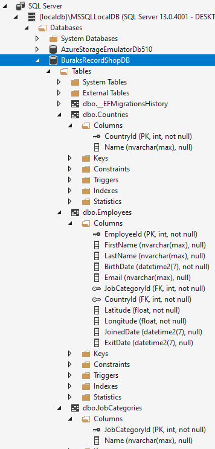
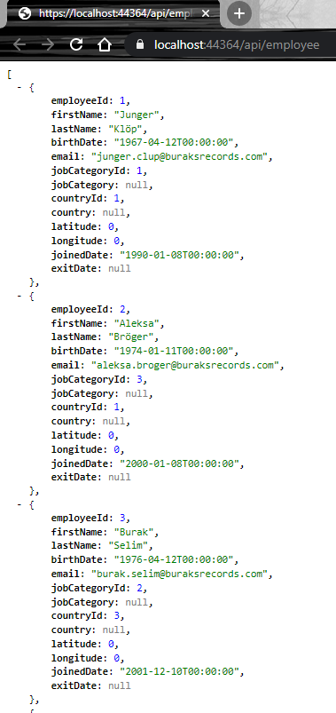

# Blazor Çalışması (DEVAM EDİYOR)

Pluralsight'tan aldığım _[Blazor:Getting Started](https://app.pluralsight.com/library/courses/getting-started-blazor/table-of-contents)_ eğitimini çalıştığım Repo.

Örnek uygulama Burağın dünya çapında ün yapmış plak dükkanlarının insan kaynakları yönetimi için kullanılıyor :) Kurstaki CSS giydirme gibi tasarım konularını atladım. Uygulama ortak bir kütüphane dışında data için birde Web API kullanıyor.

## Platform

- Windows 10
- Visual Studio 2019 Community Edition

## Bazı Bilgiler

- Api tarafı veritabanı olarak Local SQL Db kullanıyor _(Pekala farklı bir veritabanı sistemi de seçilebilir)_ Buna erişmek içinse Entity Framework Core'dan yararlanıyor _(Api projesinde kullanılan Nuget paketlerine bakın)_ İlk başta Migration planı oluşturup veritabanını üretmek için, Package Manager Console üstünde Api projesi seçili iken aşağıdaki terminal komutlarını çalıştırmak yeterli. İşlemde bir sorun olmazsa appsettings.json içindeki Connection String bilgisine göre bir veritabanı üretilmiş olmalı.

```bash
Add-Migration InitialCreate
Update-Database
```

İşler yolunda gitti ve hem veritabanı oluştu 



hem de API çalışır hale geldi.



- App uygulamasında DataService'ler IHttpClientFactory'yi kullanmakta. Bu nedenle program sınıfındaki DI register işleminde yer alan AddHttpClient metodu için Microsoft.Extensions.Http Nuget paketine ihtiyaç var.
- Web API entegrasyonu sonrası çözümü çalıştırırken Multiple Startup Projects kısmında önce Api sonrasında App uygulamalarının ayağa kalkacağını belirtmemiz işimizi kolaylaştırır. Özetle önce Api sonrasında App uygulamaları ayağa kalkmalı.
